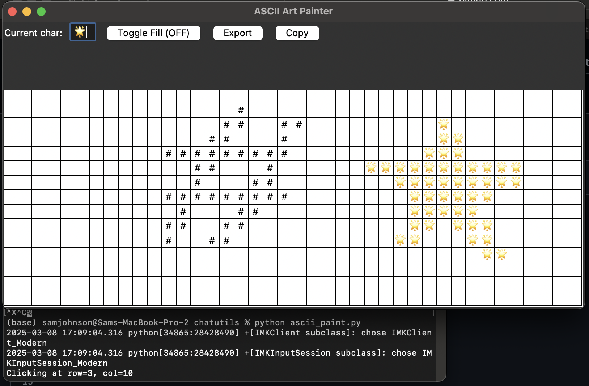

# Chat Utilities
 
There are a lot of modalities of art I want to share with AI.
 
✅ Ascii figures / art  
➡️ Music (scores), esp. polyphony  
➡️ Visual art (esp. Szpakowski)  
➡️ Optical illusions and "impossible shapes."  
  
Why? Well, I want to ask what it makes of all of it!  
 
## Current functionality  
   
This is just a tiny widget you can run in the command line. It pulls up a canvas, which lets you click, drag, and fill areas with the ascii characters of your choice. o1 made it with my substantial beta tester patience today, in about an hour. Enjoy!
Here's what it looks like!

One easy thing I mean to do is make it easy to specify canvas size on the fly. Maybe soon :)
